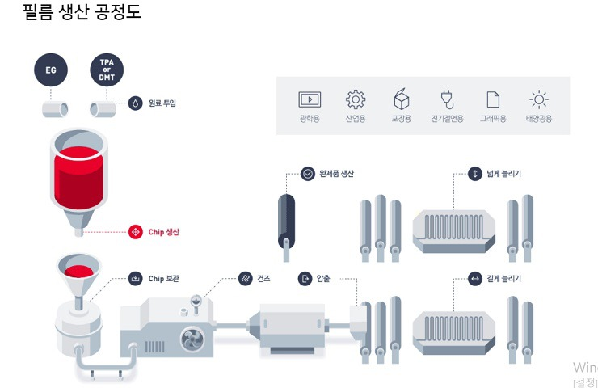
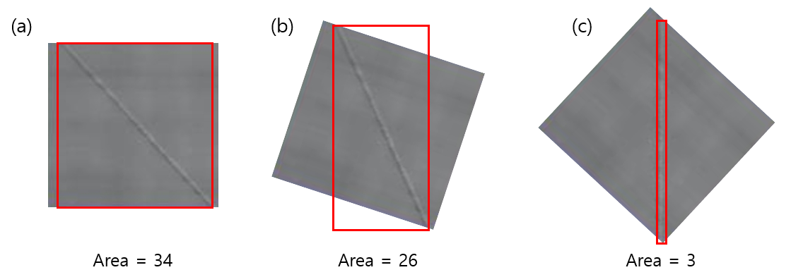
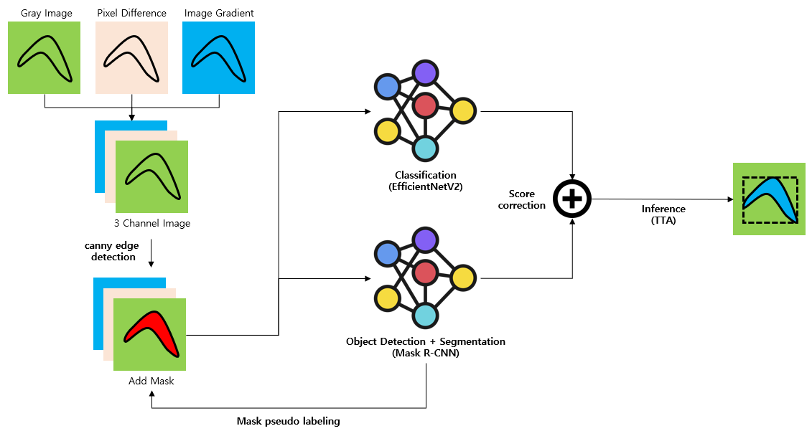
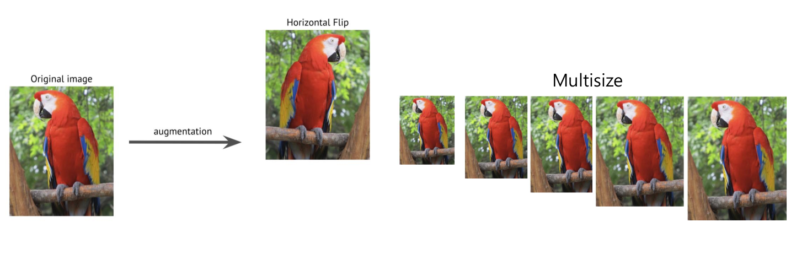
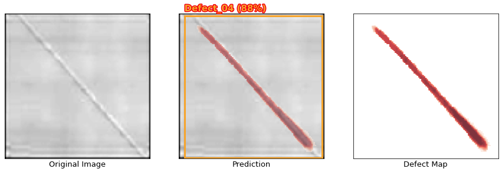

# Film Defect Detection

## 들어가기에 앞서

본 문서에서는 웹에 공개된 필름 이미지만을 사용하였음을 미리 밝힙니다.  

> [https://www.programmersought.com/article/17576123317](https://www.programmersought.com/article/17576123317/)  
> [http://winspection.com/surface-inspection.php](http://winspection.com/surface-inspection.php)

## 개요

제1회 SK AI 경연은 '21년 SK 이천포럼의 행사입니다. 이번 경연은 SK케미칼의 Film 이미지 데이터를 활용한 불량 탐지를 주제로 진행되었습니다.

## 목적

필름 생산 공정 중 생산 완료 전 단계에서 이물검사기를 사용해 완제품 생산 단계의 필름을 검사합니다. 이물검사기에서 탐지된 이물 중에는 정상판정이 가능한 것과 불량이 나뉘기 때문에 품질 관리 담당자가 맨눈으로 검사를 한 번 더 진행합니다. 최근 스마트폰, 디스플레이, 배터리 등의 수요 증가로 더 정교하고 더 많은 이물 검사가 필요하게 되었습니다. 이에 따라 제품의 합격 여부 판정을 자동화하는 모델을 개발하는 것이 목적입니다.

경연의 범위는 필름 이미지 내 이물의 종류 구분 (Classification)과 위치와 크기를 나타내는 경계 상자 (Bounding Box)를 찾는 것입니다.

[https://www.skcareersjournal.com/tag/필름공정](https://www.skcareersjournal.com/tag/%ED%95%84%EB%A6%84%EA%B3%B5%EC%A0%95)

## 이물 탐지에서 Bounding Box의 단점

이러한 문제를 해결하고자 물체를 좀 더 직접적으로 탐지할 수 있는 영상 분할 기법 (Image Segmentation)을 시도했습니다. Image Segmentation에서는 물체를 픽셀 단위로 탐지하기 때문에 이물의 크기를 더 정확히 측정할 수 있습니다. 아래 그림에서는 Bounding Box와 Segmentation으로 집의 위치를 탐지하는데 Segmentation이 더 세밀하게 구분하고 있음을 확인 할 수 있습니다.

​                                                         그림: 이미지 회전에 따른 Bounding Box 크기 변화

이러한 문제를 해결하고자 물체를 좀 더 직접적으로 탐지할 수 있는 영상 분할 기법 (Image Segmentation)을 시도했습니다. Image Segmentation에서는 물체를 픽셀 단위로 탐지하기 때문에 이물의 크기를 더 정확히 측정할 수 있습니다.

​                                  Image Segmentation ([https://github.com/matterport/Mask_RCNN](https://github.com/matterport/Mask_RCNN))

## 구현 방법

​                                                                                      그림: 구현 방법 

- 데이터 전처리
  원본 이미지는 100 x 100 크기 단일 채널의 흑백 이미지입니다. Bounding Box를 더 잘 찾도록 상하 좌우 픽셀값 차이 (Pixel Difference) 및 미분 값 (Image Gradient)를 계산하여 3개 채널을 가진 이미지를 생성합니다.
- 마스크 추가
  이번 경연에서는 마스크를 제공하지 않습니다. Segmentation을 위한 Mask label을 생성하기 위해 이물의 Edge를 검출합니다. Edge 검출에는 canny edge detection 사용했으며, 경계값을 얻기 위해 concave hull 알고리즘을 적용했습니다.

​           Canny edge ([https://docs.opencv.org/3.4/da/d22/tutorial_py_canny.html](https://docs.opencv.org/3.4/da/d22/tutorial_py_canny.html)), Concave hull ([ian-ko.com](https://www.ian-ko.com/ET_GeoWizards/UserGuide/concaveHull.htm))

- Mask pseudo labeling
Edge Detection으로 찾아낸 이물 경계는 정확하지 않습니다. 이러한 문제를 해결하기 위해 Mask R-CNN을 50 epoch 만큼 훈련 후 예측된 결과로 Mask를 다시 생성해 훈련에 활용했습니다.
- Model
모델로는 Mask R-CNN ([https://arxiv.org/abs/1703.06870](https://arxiv.org/abs/1703.06870)) 을 사용했습니다. 보조적으로 이번 경연의 데이터는 한 이미지에는 하나의 이물 종류만 존재하기 때문에 이물 종류 구분을 위한 classification 모델로 EfficientNetV2 ([https://arxiv.org/abs/2104.00298](https://arxiv.org/abs/2104.00298)) 를 활용했습니다. 모델 훈련에 사용된 기법은 아래와 같습니다.

1. **Data Augmentation**: Horizontal Flip + Random Rotation + Random Brightness Contrast  + Random Scale
2. **Optimizer**: AdaBelief ([https://arxiv.org/abs/2010.07468](https://arxiv.org/abs/2010.07468))
3. **Scheduler**: CosineAnnealingWarmupRestarts ([https://github.com/katsura-jp/pytorch-cosine-annealing-with-warmup](https://github.com/katsura-jp/pytorch-cosine-annealing-with-warmup))
- TTA
결과 예측 시 TTA (Test Time Augmentation)을 사용합니다. TTA 적용시 성능이 약 3% 향상됩니다. Object Detection 문제에 적합하다고 알려진 Horizontal Flip + Multiple Scale을 적용했습니다.

​                그림: TTA 적용 Augmentation ([https://chacha95.github.io/2021-06-26-data-augmentation2/](https://chacha95.github.io/2021-06-26-data-augmentation2/))

- Weighted Boxes Fusion
TTA 이후 여러 개의 Bounding Box가 생성되는데 여기에 Weighted boxes fusion (WBF, [https://arxiv.org/abs/1910.13302](https://arxiv.org/abs/1910.13302))을 적용합니다. WBF는 NMS와 달리 모든 Bounding Box를 사용해 평균적인 Box를 얻어내기 때문에 성능 향상에 도움이 되는 것으로 알려져 있습니다.

## 결과

학습 데이터는 공개가 되지 않는 관계로 웹에서 검색한 이미지를 활용해 예측을 진행했습니다. Bounding Box와 함께 이물의 위치를 픽셀 단위로 마스크로 표현합니다. 훈련에 사용된 이미지와는 이물 종류, 모양 등 특성이 다름에도 비교적 이물의 위치와 크기를 잘 탐지하고 있습니다 (이물 종류는 비식별 처리됨). 예측된 마스크의 픽셀 개수를 합하여 이물의 크기를 계산할 수 있습니다. 

그림: 예측 결과 1, 긴 형태의 이물에서 이물의 위치가 있는 부분이 마스크로 표현 됨

그림: 예측 결과 2, 넓은 형태의 이물

그림: 예측 결과 3, 복수 개 이물을 탐지

Box 예측 성능은 COCO metric 기준 (mAP@IoU=[.50:.05:.95]) 0.6151 입니다.

## 한계

마스크를 Edge Detection으로 생성했기 때문에 이미지가 희미한 경우 잘 탐지하지 못합니다. 문제를 해결하기 위해 Super Resolution 등을 시도해 봤지만, 결과가 크게 나아지지는 않았습니다. CAM (Class Activation Map) 등 AI 방법론이 더욱 효과적일 것으로 생각됩니다.

## 성능 향상 방법

1. 도움이 됨
- Augmentation: Horizontal Flip,  Random Scale
- TTA: Horizontal Flip,  Random Scale
- Weighted Boxes Fusion: IoU threshold = 0.7, Skip box threshold = 1e-4 (or 0)
2. 도움이 안됨
- Augmentation: Random Rotation,  Random Brightness Contrast 
-TTA: Random Rotation,  Random Brightness Contrast 
- Classification 모델: Mask R-CNN 단독으로 사용 시 성능이 좋음
